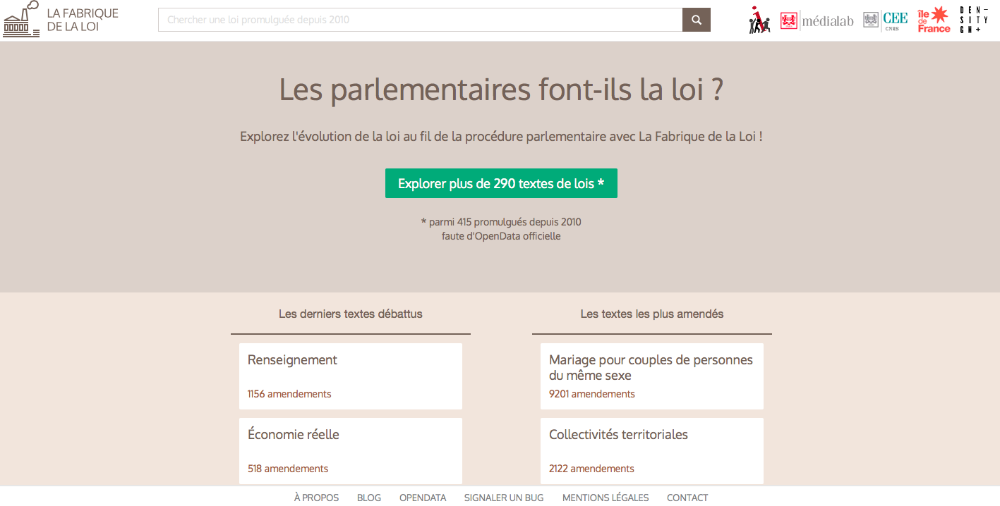

# La Fabrique de la Loi

Organisational Structure
:   Project led in collaboration between 2 research labs at SciencesPo and the NGO Regards Citoyens

Interviewee
:   Benjamin Ooghe-Tabanou

Status
:   Maintained but not regularly updated 

Start date of the project
:   2011

Team
:   Large

Type of funding
:   Grant

Budget amount
:   €150,000 grant from the Ile de France Region fund over 3 years

Location
:   Paris (France)

URL
:   http://www.lafabriquedelaloi.fr

Type of output
:   290 law texts analysed and visualized (from proposal bill to its published version) showing how parliamentary process in France works.

Visit the [La Fabrique de la Loi project page](projects/la-fabrique-de-la-loi.html)

La Fabrique de la Loi publishes and tracks the evolution of bills through French Parliament from their inception to the final publication, showing through visualizations the chronological changes to the text and the related debates history between the different MPs. Aside from the web interface, the data is also made accessible through an API. 

The goal of La Fabrique de la Loi is “to easily understand and visualize the French parliamentary process”. The site and API are the products of a three year long research project between two research labs from Sciences Po in Paris: The [médialab](http://www.medialab.sciences-po.fr/) and the [Center for European Studies (CEE)](http://www.cee.sciences-po.fr/) and [Regards Citoyens](https://www.regardscitoyens.org/), an NGO urging for transparency in the public sphere. 

The project started in 2011, funded by a grant of €150 000 from The Region Ile de France to sponsor and support innovation and research for citizens. The grant was used to support the team during three years, including funding the salary of a PhD candidate and the designers who worked on the visualization part of the website, and to support conferences and workshops.

To retrieve the texts and the different MPs votes, the team programmed scrapers to extract data from different websites and reformat it. However, as Benjamin Ooghe-Tabanou reported “this process did not succeed in 30% of the cases” because of the wide diversity of the formats used by the National Assembly and the Senate to publish their documents.
 
There has not been an impact assessment regarding the project so far and Ooghe-Tabanou even considers it “mostly unknown by the broad public”. However, according to Ooghe-Tabanou, the project was well known by some MPs assistants, and had been used by activists during the campaign against the surveillance bill in France to track the parliamentary processes. Looking at it with hindsight Ooghe-Tabanou even hopes that the project contributed to raise awareness about political open-data in France.
 
The tools used by the project team are all free software, which is a choice and a statement according to Ooghe-Tabanou: “transparency has to be applied even to the code”. The scrapers were programmed with bash, perl and Python; D3.js was used to compute the visualisations. Finally, La Fabrique de la Loi tried to document as much as possible their technological choices [on their website](https://www.lafabriquedelaloi.fr/a-propos.html). 

Today, La Fabrique de La Loi is no longer actively updated and the project is, as Ooghe-Tabanou qualified it, “sleeping”, but the team voluntarily chose to upload information from to time to time regarding “symbolic and key” texts such as the surveillance bill which was voted by the Parliament in July 2015. If time and opportunities allow it, they would like in the future to complete the automated extraction of the data to include all bills live during their parliamentary discussion.
