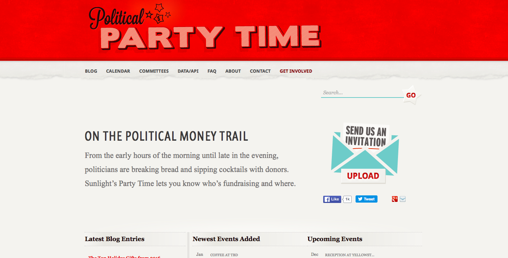

# Political Party Time

Organisational Structure
:   Project incubated at the Sunlight Foundation

Interviewees
:   Jen Topper, Communications Director at Sunlight Foundation and Joshua Stewart, Deputy Communications Director at Sunlight Foundation

Start date of the project
:   2007

Team
:   Size variable (from Small to Medium)

Type of funding
:   Donations

Budget amount
:   Not disclosed

Location
:   Washington D.C. (USA)

URL
:   http://politicalpartytime.org

Type of output
:   A tracking system to shed light on cocktail parties and informal meetings organized to raise money for political campaigns or influence candidates through lobbying

Visit the [Political Party Time project page](../projects/political-party-time.html)

Political Party Time helps to track political fundraising events and the movement of political actors from event invitations. This information can be used to map the relationships between candidates and private interests from different sides. Launched in 2007 by the Sunlight Foundation, the project is still maintained by the organisation but no longer funded.

Invitations to fundraising events are contributed by users who can submit an invitation by emailing or by sending it anonymously through the website interface. A small reporting team actively contributes to Political Party Time by tracking these invitations. As Topper and Stewart put it, Political Party Time aims for “content generation”. Its objective is to lead storytelling based on the fundraising event information collated on the website.
 
The site is fairly simple and it uses open source tool programmed by Sunlight Foundation. Stewart explains that “they created a standardized form that allows admin, with basic data entry training, to enter fundraising invite data. The key is to tag the post with as much information as possible from the invite. This allows for our database to connect to previous hosts, lawmakers, and even venues.” The metadata is made available as bulk downloads “so any individual or organization can download our entire invite database”. The data collection is entirely done manually. Sunlight Foundation is currently working on scripts to automate the data collection (scraping from PDFs) but so far this has not been released.

No precise metrics for impact assessment have been reported, however the two interviewees mentioned how one of the recent achievement of the project was to uncover Jeb Bush’s presidential campaign launch. By tracking the body of evidence (the invitations), the project managed to infer his political candidacy.
