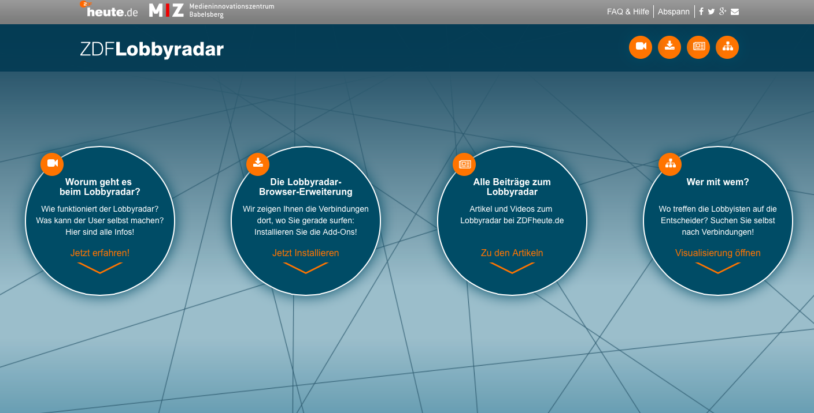
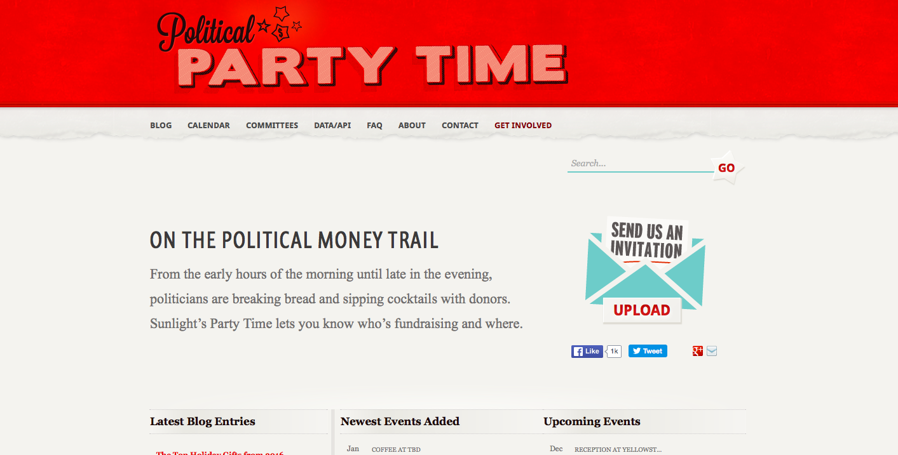

# Case Studies

We picked a handful of projects for deeper investigation, and interviewed project representatives to explore further the influence mapping space. These projects represent diverse practices, geographical and thematic focus, and technological approaches. 

    

        
        <a href="cargografias.html">Cargografias</a>
    

    

        
        <a href="influence_map.html">Influence Map</a>
    

    

        
        <a href="la_fabrique_de_la_loi.html">La Fabrique de la Loi</a>
    

 

    

        
        <a href="lobbyradar.html">LobbyRadar</a>
    

    

        
        <a href="open_duka.html">Open Duka</a>
    

    

        
        <a href="parltrack.html">Parltrack</a>
    

 

    

        
        <a href="political_party_time.html">Political Party Time</a>
    

