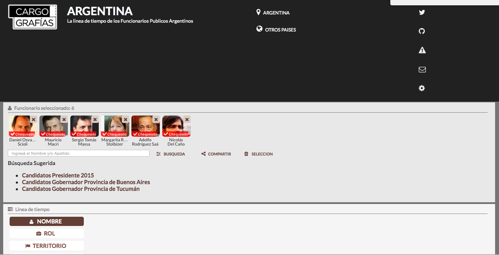

Cargografías allows you to explore the timelines of the electoral mandates of the Argentinian representatives, in order to foster transparency in Argentinian politics, to help citizens to get a full picture of the political history of the presidential candidates and members of the government in Argentina, and thus make decisions based on these facts.

Cargografías started in 2013 as a pro bono initiative by founder Andrés Snifcofsky. A graphic designer by training, Snifcofsky chose this issue of transparency in politics as an opportunity to expand his skills in interactive design. Snifcofsky started by manually scraping the information in order to create a prototype quickly: “So I built, like, a 500 rows of information, of names and dates and roles, so I used that little data set as a starting point, as a proof of concept to build the visualization,” he says.

The project has benefitted from its very beginnings from collaborative and co-learning environments, such as collaborative workshops uniting the interactive design and data journalism communities in Buenos Aires, project management and programming workshops. It was here that Snifcofsky met developers who entered the team and helped him building the last version of Cargografías. The project uses open source tools such as D3.js and open source standards for data management such as Popolo and Popit, made available by MySociety. Cargografías made a decision to use Popit because it was also a standard within the community of practice as a way also to promote open data: “We chose Popit mostly because we wanted to get some connection with the rest of the community”.

Data for Cargografías is scraped from online sources and cross checked using bespoke web scraping scripts. Where data sources are not machine readable, the data are processed manually. Methodologies from journalism have been adopted, such as the cross checking of data and the importance of making editorial decisions on the use of the data when structuring and ordering it.

The project has always had very limited financial resources and the money was only enough to pay people in a “symbolic way” and to improve the infrastructure as Snicofsky underlines it: “I got three different micro-grants in the next two years that got me where we are right now, that we have a functioning platform”.
 
It is particularly hard to assess the impact of Cargografías, as its aim is to inform voters - an output that is difficult to measure. However, its importance as an idea is somewhat reflected by its expansion into Brazil.
 
The aim is to expand Cargografías further to cover the whole Latin American continent, providing information about the political backgrounds of candidates in multiple countries. The different regional chapters would be lead by regional teams. This new model opens up Cargografías to more diverse sources of funding in different countries and if successful could allow it to become a reference for citizens at a regional scale.
