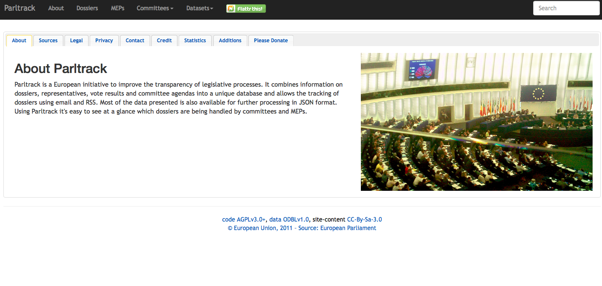

Parltrack is a free database of European Union dossiers, committee meetings and the people who contributed to them. The project started in 2011, during the campaign against ACTA (the Anti-Counterfeiting Trade Agreement). 

Since its launch, Parltrack has been lead by one person, who maintains the project and manages the website. Parltrack is built using open source tools: Python for the scrapers and Mongo DB for the data management. The project has benefitted from open source development through coding contributions from the wider community. Parltrack also benefitted from crowdsourcing campaigns and donations, the most recent reached €11,000 to pay the maintenance of the website.
 
Parltrack uses web scrapers to gather data automatically, predominantly from the website of the European Parliament. There are frequent changes to this site, however, and as a result frequent changes to the web scrapers are necessary to maintain consistent data collection. This is often a time consuming exercise: “I had to debug the site for like half a day to find out why one of my scrapers didn’t work, and then it turned out that the European parliament changed the URL of one of their search interfaces.” Stef, Parltrack. This dynamic environment informed the decision to use Mongo DB, which was considered a good choice of database to store data from the European Parliament “which are constantly changing”.
 
In terms of impact, the Parltrack dataset has been used by other projects such as Political Memory, LobbyPlag and Score EP. “I really like to think of it [Parltrack] as a data provider, and I have all these cool NGOs and projects who use my data and do really really cool stuff with it that I'm really proud of, so, to support these people and projects.” Stef, Parltrack. The project is lauded by hacktivists as one of the cornerstones of the transparency movement, according to European political news site Politico, and has underpinned work by Transparency International on lobbying.
 
Paltrack will remain an independent project and will host freely the database, an ideological choice to keep the data available and open so that others can build on Parltrack and  challenge the existing power structures - to “make the powerful people sweat”.
